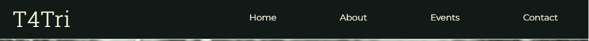

# T4Tri Triathalon Club

# Goal for this Project
Welcome to T4Tri Triathalon Club. This club provides an outlet for all age groups from 16 to 116 to get involved and give trathalons a go. 

This site gives some information about the club, basic information about triathlons and club events to capture the eye of a potential member. It also give the ability to make contact with the club easily through social media or directly via the contact form.

# Table of Contents
* [UX](#ux "UX")
    * [User Goals](#user-goals "User Goals")
    * [User Stories](#user-stories "User Stories")
    * [Site Owners Goals](#site-owners-goals)
    * [User Requirements and Expectations](#user-requirements-and-expectations)
         * [Requirements](#requirements)
         * [Expectations](#expectations)
     * [Design Choices](#design-choices)
        * [Fonts](#fonts)
        * [Icons](#icons)
        * [Colours](#colours)
        * [Structure](#structure)
    * [Wireframes](#wireframes)
    * [Features](#features)
        * [Existing Features](#existing-features)
            * [Navigation Bar](#navigation-bar)
            * [Landing Page](#landing-page)
        * [Features to be implemented](#features-to-be-implemented)
    * [Technologies used](#technologies-used)
        * [Languages](#languages)
        * [Tools and Libraries](#tools-and-libraries)
    * [Testing](#testing)
    * [Deployment](#deployment)
    * [Credits](#credits)
# UX

## User Goals
* Visually appealing, including images.
* Easily navigated around.
* Quality and valuable content.
* Easily found contact details.
* Form to directly contact the club.
## User Stories
* As a user, I want to know that the club is well established.
* As a user, I want the website to give me information about what is involved in trathalon.
* As a user, I want to be able to easily contact the club.
* As a user, I want to be able to make contact with the club via several different methods, i.e. social media.
* As a user, I want to be able to easily navigate through the website.
* As a user, I want to know where the club is based.
* As a user, I want to know what events are taking place.
## Site owners Goals
* Promote the club.
* Increase the number of members.
* Increase rankings on search engines.
### Requirements
* Easy to navigate on varius screen sizes.
* Clear information on the services provided.
* Keep the user interested with small bits of information to make them want to engage with the club.
* Simple methods of contacting the club.
* Visually inviting so users don't leave.
### Expectations
* I expect to know if a form has been submitted properly and if items are not filled in, to be prompted.
* I expect all links to social media sites to be opened in a new tab.
* I expect all navigation links to work correctly.
* I expect screen size not to effect the quality of the website.
* I expect all information to be correct and accurate.
## Design Choices

### Fonts
In order to move away from the basic fonts available, I have used 
[Google Fonts](https://fonts.google.com/ "Google Fonts") to find a text that best suits the feel of the website. For the main text I have chosen [Montserrat](https://fonts.google.com/specimen/Montserrat?query=mon "Montserrat font") as I feel it is has a sharp, simple and easy to read look. To make the headers and the navigation bar stand out form the text, I decided to use [Roboto Slab](https://fonts.google.com/specimen/Roboto+Slab?query=rob "Roboto Slab font"). This font is complimentary to Montserrat but gives clear definition between text and headers.

### Icons
I will used some icons for my website from the [Font Awesome library](https://fontawesome.com/ "Font Awesome"). These icons will only be used where there is no explination needed to their meaning, social media links, contact links and a hamburger for navigational links on smaller devices. All icons used will be styled and in keeping with the appearance of the website.

### Colours
I have used [Colourmind](https://colormind.io/ "colourmind") to help in the selection of my colour scheme. I selected the initial colour that I wanted the reast of my pallet to fit with and then used the generator to create the pallet, it can be seen [here](wireframes/colour_pallet.JPG "Generated Colour Pallet"). However when I tested the contrast of the colours in [WebAIM](https://webaim.org/resources/contrastchecker/ "WebAIM"), the contrast ratio from the text colour to the background colour was not good enough and failed tests, they can be seen [here](wireframes/contrast-checker.JPG "Failed tests"). After adjusting the colours manually, I gained a pallet that still gave great impact and had great contrast, these are the results for the contrast checker are [here](wireframes/contrast-checker-adjusted.JPG "Adjusted Colour Pallet").

I will explain the uses of the varius colours below, starting from top to bottom.

 
 * #8C00B3 - This colour will be used as a background colour for sections and as a text colour.
 * #FFFDDF - This colour will be used as a background colour for sections and as a text colour.
 * #8E689B - This colour will be used on the contact form for added styling.
 * #92579F - This colour will be used as a backgroung behind any images used.
 * #121A18 - This colour will be used as a text colour and also the navigation and footer background colour.

### Structure
I will be building my website with a mobile first mindset using the iPhone 5/SE (320px) as the smallest screen size for styling to look good on. The screen size breakpoints that I will be using are from [Bootstrap breakpoints](https://getbootstrap.com/docs/5.0/layout/breakpoints/ "Bootstrap").

| Screen Size | Breakpoint |
| ----------- | ---------- |
| x-small     | <576px     |
| small       | => 576px   |
| medium      | => 768px   |
| large       | => 992 px  |
| x-large     | => 1200 px |
# Wireframes
I have used [Balsamic](https://balsamiq.com/wireframes/ "Balsamic") to develop my wireframes for my website. I initially created the mobile version and then the wireframes and then scalled it up for both tablet and desktop. Because a requirement is to give little but quality information to the user to make them want to engage with the club, a one page website is used. This gets the user through the content and quickly to the contact form and details via scrolling or directly via the navigation bar.

The wireframes are below:

### [Desktop Wireframe](wireframes/T4Tri_desktop.png "Desktop wireframe")
### [Tablet Wireframe](wireframes/T4Tri_tablet.png "Tablet wireframe")
### [Phone Wireframe](wireframes/T4Tri_phone.png "Phone wireframe")
# Wireframes

# Features

## Existing Features

### Navigation Bar

The navigation bar is fully responsive to allow for various screen sizes. It includes links to manover around the site easily and also the club logo which doubles as a link back to the home screen.

+ Desktop (>=992px)
\
&nbsp;
    
    -   Spanning the full width of the device and with all links (Home, About, Events, Contact) to navigate visible, this gives ease and clear use to the end user.

    -   In order for the user to visably see which of the links they are hovering over there is a bar below the text.

    
    \
    &nbsp;
    -   For the user to know that a link has been clicked there is also a visual aid of the text changing colour.

    
    \
    &nbsp;

+ Small devices (<992px)
\
&nbsp;
    - As the navigation bar would be unuseable in the desktop version on smaller devices, it takes on a hamburger style.

    \
    &nbsp;

    - When pressed, it open up the main menu with all the links available then.

    \
    &nbsp;

    \
    &nbsp;

### Landing Page

+ The landing page image
    - The image gives the user instant knowledge of what is involved in the club, and with added animation draws their eye to the site.
    - The text gives instant information to the user on what the club is. With the added animation of fading in slightly behind the image, it makes the user keep interest. 
    \
    &nbsp;

    

    \
    &nbsp;

### Welcome Section

+ The welcome section gives a brief introduction to the user on the what T4Tri is and who is welcome.
    \
    &nbsp;

    
    \
    &nbsp;

+ To speed up user interation, there is a *'Join Us'* button that directly links to the contact form. This button has a hover effect on it in the form of an animation to allow the user to know that it is something to be pressed.
    \
    &nbsp;

    
    \
    &nbsp;

### About Section

+ The about section gives a brief, and attemped humerous, description of the diceplins of triathlon with the adition of a character showing the user what is involved, even if they do not want to read the descriptions. It is also responsive to suit the different screen sizes.
    \
    &nbsp;

    *Desktop*

    
    \
    &nbsp;

    *Laptop*
    
    
    \
    &nbsp;

    
    *Phone and Tablet*
    
    
    \
    &nbsp;

### Events Section

### Contact Section

### Footer

## Features to be Implemented

# Technologies used

## Languages
* [HTML](https://en.wikipedia.org/wiki/HTML "HTML")
* [CSS](https://en.wikipedia.org/wiki/CSS "CSS")

## Libraries & Framework
* [Google Fonts](https://fonts.google.com/ "Google Fonts")
* [Font Awesome library](https://fontawesome.com/ "Font Awesome")
## Tools
* [Gitpod](https://www.gitpod.io/ "Gitpod")
* [Balsamic](https://balsamiq.com/wireframes/ "Balsamic")
* [W3C HTML Validation Service](https://validator.w3.org/ "W3C HTML")
* [W3C CSS Validation Service](https://jigsaw.w3.org/css-validator/ "W3C CSS")
* [Bootstrap](https://getbootstrap.com "Bootstrap")
* [Colourmind](https://colormind.io/ "colourmind")
* [Font Awesome library](https://fontawesome.com/ "Font Awesome")
* [Google Fonts](https://fonts.google.com/ "Google Fonts")
* [Unsplash](https://unsplash.com/ "Unsplash")
# Testing

## Examples

## Bugs

# Deployment

# Credits
* [Mark Caron](https://medium.com/@heyoka/responsive-pure-css-off-canvas-hamburger-menu-aebc8d11d793 "Marc Caron")